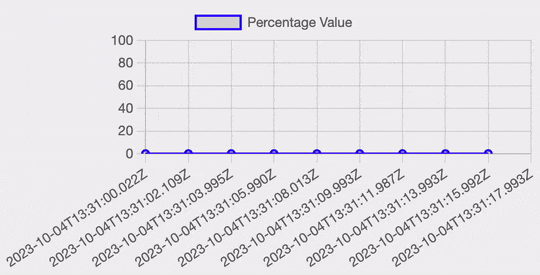
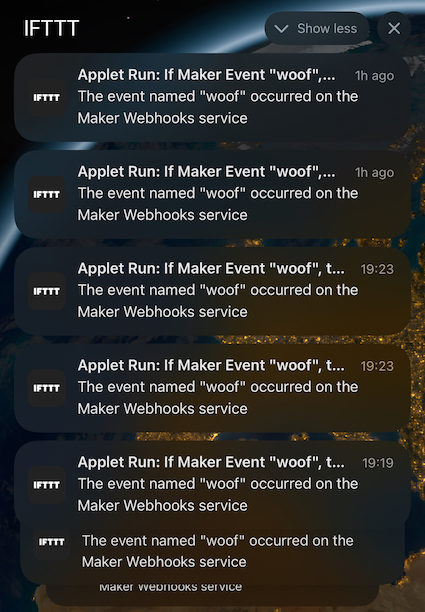

# woofalytics
AI Powered Woof Analytics!

This project utilises a Raspberry Pi and a microphone array to identify dog barks. It includes a straightforward pre-trained model, but you also have the option to customise and train it to meet your specific needs.

The primary motivation behind this project was to differentiate between our neighbor's dog's barking and our own dog's vocalisations. The issue I aimed to address was as follows: when our neighbor's dog barked, it triggered our dog to respond with barking, leading to an incessant cycle of noise. To disrupt this pattern, some dog trainers recommended providing our dog with treats when the neighbor's dog barked, diverting his attention to something more exciting (such as eating treats) instead of barking in response. To accomplish this, I developed this project and further automated it automatic treat dispensers (which are not included in this repo), and it has proven to be remarkably effective, almost like magic!

# Hardware Setup
I deployed this solution on a Raspberry Pi 4 computer equipped with a dual-channel microphone array. The Raspberry Pi is running the 64-bit version of the Raspberry Pi OS. The microphone array utilised in this setup is manufactured by Andrea Electronics. For additional information about the microphone, please visit the [Andrea Electronics website](https://andreaelectronics.com/array-microphone/).
A sample photo of the micrphone array:


The reason for using this microphone array is that it doesn't require any driver installation on the Raspberry Pi 4 (I used 64-bit version of the Raspberry Pi OS).

# Software Setup

First install a few packages for audio capture on the Pi OS:

```shell
# This is tested on Raspberry Pi OS (Debian GNU/Linux 11 (bullseye) / aarch64)
$ sudo apt update
$ sudo apt install \
    build-essential \
    libportaudio2 \
    libasound2-dev \
    libusb-1.0-0-dev \
    python3-pyaudio
```

The code is based on Python. Continue installing the rest of the dependency packages:
```shell
$ pip install -r requirements.txt
```

And to run the main code, just run `main.py`:
```shell
$ python main.py
```

If all packages are installed and there are no other problems, you should see some messages like:
```
INFO:Main:Starting Woofalytics server, press Ctrl+C to stop...
INFO:Woofalytics:Starting recording loop...
DEBUG:Woofalytics:Clip past context seconds: 15, number of frames: 3000
DEBUG:Woofalytics:Clip future context seconds: 15, number of frames: 3000
Starting server on port 8000...
INFO:Woofalytics:Window len #samples: 264, overlap #samples: 132
[2023-10-03T22:46:37.611563, 090, 090, 090]: Not barking: 0.007565224077552557
```
the last line shows direction of arrival of the audio to the microphone array estimated using three different algorithms (hence three times `090`), followed by probability of barking, which in this case is almost zero. 

## Web Interface
If you want to see a visualisation of bark probabilities in real-time, you can navigate to `http://127.0.0.1:8000` and you should see a screen similar to this:


There are a few more endpoints, such as `/api/bark` which will return a JSON struct containing the bark probablity in realtime:
```json
{
    "datetime": "2023-10-03T23:44:52.168245", 
    "bark_probability": 0.0724762910977006
}
```
 This can be used for further automation. In case you would like this setup to be used for data collection (i.e. recording your own dog barks), you can navigate to `/rec` and will see a `Record` button that will store an audio clip from 30 seconds before the time you pressed the record button for another 30 seconds (you can configure all these values in the `record.py` file). This can later be used for training your own model if you want to distinguish different dog barks from each other. But be prepared to record and label at least tens of hours of data before getting anything useful! 

## IFTTT Integration
If you want to trigger some actions when a dog bark is detected, you can use the IFTTT integration. You just need to update `record.py` and set these two values:
```python
IFTTT_EVENT_NAME = "woof"
IFTTT_KEY = "YOUR_IFTTT_WEBHOOKS_KEY"
```

it uses WebHooks and you can further automate actions using this trigger. Any smart device that works with IFTTT can be used, such as [Aqara Smart Pet Feeder C1](https://www.aqara.com/eu/product/smart-pet-feeder-c1/) which I initially used for my project. Sample notifications from IFTTT integration:


# Re-training the Model
Please refer to the `notebooks/woofalytics-model.ipynb` notebook for additional information. Everything should be fairly self-explanatory there, although it may appear a bit disorganised. I've also included some sample recordings to ensure that you can run the notebook without any issues.
